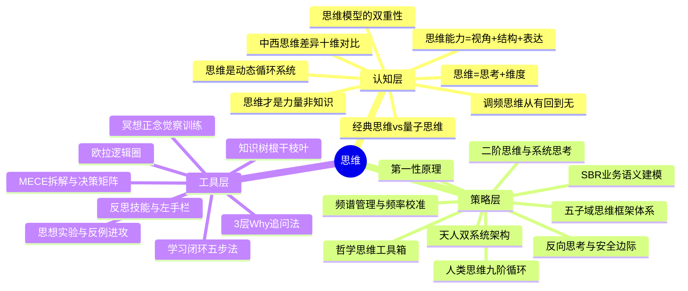

# 思维 知识萃取报告

## 一、知识体系全景

> **全景说明**：知识库中的"思维"知识呈现清晰的三层结构——**认知层**回答"思维是什么"，**策略层**回答"思维怎么运转、怎么构建体系"，**工具层**回答"用什么具体方法落地"。三层之间有明确的逻辑递进：认知决定策略选择，策略决定工具组合。

---

## 二、方法论体系重塑

### 第一性原理：思维是"从无到有再从有归无"的频率调校过程

如果只能用一句话概括这个知识体系运转的根本原因，那就是：**思维的本质不是知识积累，而是一种持续的频率调校——从混沌到有序（认知建构），再从有序到空灵（减法回归），在"有"与"无"的动态平衡中持续进化。**

这个第一性原理贯穿了所有文档：西方思维传统强调"从无到有"的建构方向——用思维模型、逻辑框架、知识体系把混沌的信息变成可操作的认知；东方思维传统则强调"从有归无"的回归方向——用减法、损之又损、空杯心态把执念和偏见清空，让更深的洞察自然涌现。两股力量不是对立的，而是同一个呼吸的吸与呼。

### 核心支柱

围绕这个第一性原理，整个知识体系由三大核心支柱支撑：

#### 支柱一：认知建构力——"从无到有"的思维建筑术

这个支柱解决的问题是：**面对混沌的信息和陌生的领域，如何快速搭建起可操作的认知框架？**

它的内涵包括三个层级：
- **思维的本质定义**：思维=思考（动态过程）+维度（静态结构）。"为什么有些人思考得又快又好？不是脑子转得快，而是脑子里有成熟的'结构（维度）'，遇到问题能快速匹配对应分析维度。"这是整个体系的基石定义。
- **思维能力的三维模型**：视角（看事物的角度）+结构（多视角搭建的框架）+表达（如何呈现和描述）。三者缺一不可——有视角无结构是碎片，有结构无视角是空壳，有结构有视角无表达是锁在脑子里的宝藏。
- **认知建构的具体路径**：事物认知域（N+E+T三维框架）→问题解决域（感知定义→MECE拆解→模式匹配→决策矩阵→执行验证）→知识管理域（知识组件+知识树）→学习实践域（输入→内化→实践→复盘→沉淀）→能力架构域（4A模型）。

#### 支柱二：批判超越力——"破除思维牢笼"的越狱术

这个支柱解决的问题是：**已有的认知框架本身可能就是最大的陷阱，如何打破它？**

它的内涵来自多个交汇点：
- **思维模型的双重性**：思维模型既能简化生活，也可能成为"盲人摸象"的牢笼。"如果不被我们察觉，会导致我们固执认为自己的认知是唯一正确的。"每多一个思维模型，就多一种可能，但也多一种执念。
- **经典思维vs量子思维**：经典思维（牛顿式、决定论、分割化、非黑即白）是宏观低速世界的近似真理；量子思维（测不准、叠加态、纠缠、多可能性）更贴近微观世界和人的意识规律。真正的超越不是从一种思维跳到另一种，而是理解"人是经典和量子二象性的生命"，在不同场景选择不同思维模式。
- **中西思维的互鉴**：中国思维偏伦理型、整体性、直觉性、意象性、模糊性、求同性；西方思维偏认知型、分析性、逻辑性、实证性、精确性、求异性。两者不是优劣之分，而是"东方弯圈（关联、和谐）"与"西方直线（分割、竞争）"的互补——融合才能超越二元对立，抵达"第三境界"的超限思维。
- **批判的工具箱**：反例进攻法、思想实验法、欧拉逻辑圈、反思技能（暴露"左手栏"）、探询技能（对齐"宣称理论"和"使用理论"）——所有这些工具都指向同一个目标：**让你看见自己看不见的盲区**。

#### 支柱三：空性回归力——"从有归无"的调频术

这个支柱解决的问题是：**当认知建构越多、思维模型越复杂时，如何避免被自己的认知反噬，回到最本真的清明状态？**

这是东方智慧对思维体系最独特的贡献：
- **调频的本质**：从"有"回到"无"。"道冲而用之或不盈"——心本来是空的、能生万物的，杂念执念把"冲"填实才失去本频。"有之以为利，无之以为用"——空才是功能与可能的本源。
- **分别心是干扰的根源**：切割好坏、善恶、利弊的对立判断，正是思维产生痛苦的根源。"善人是不善人的老师，不善人是善人的资粮"——两者互为条件、互相成就，没有绝对的好坏之分。
- **减法的次第**：推开众妙之门→认出本频→明白空的力量→看清干扰根源→找到调频方向→动手做减法。"为道日损，损之又损，先减明显执念，再减'我在修行/我在损'的傲慢，连'损'的念头也损掉。"
- **频谱管理的现代诠释**：在信息时代，"为学日益"不再是简单积累，而是修炼"频谱管理"——用批判性思维识别和过滤噪声，只允许纯净频率与内心互动；"为道日损"则是"频率校准"——持续降噪，使内在基准频率回归纯净。

### 三大支柱的动态关系

三大支柱并非并列，而是形成**螺旋上升的动态循环**：

1. **建构力驱动超越力**：只有先建构了足够的认知，才有东西可以批判和超越。一张白纸谈不上超越。
2. **超越力驱动回归力**：批判性思维的终极发现是——越精密的认知框架越容易成为牢笼，这推动了向"空性"的回归。
3. **回归力反哺建构力**：空性不是虚无，而是"空碗朝天——什么都没有，却什么都能装"。减法做完之后，认知建构的能力反而更强、更敏锐，因为不再被旧框架绑架，能以"初心"重新感知。

这三者的循环恰好对应了老子"反者道之动"的核心洞见——**向反处走不是倒退，而是为了在更高的层级上重新出发**。

---

## 三、核心观点溯源

### 认知层观点溯源

| 提炼观点 | 原文溯源 | 出处 |
|----------|----------|------|
| 思维=思考+维度 | "思考指面对问题时大脑运转的动态过程……维度指分析事物时切入的角度和层次，是大脑中预先存在的结构化分析框架" | 《如何构建一套完整思维框架体系》 |
| 思维能力=视角+结构+表达 | "思维视角-看待事物的角度……思维结构-多个视角搭建起来的结构……思维表达-即怎么呈现和描述" | 《02思维能力模型》 |
| 思维是动态循环系统 | "思维是一个始于欲望、成于行动、终于刷新，并周而复始的演进过程" | 《梁涛的人类思维原理模型》 |
| 思维才是力量，非知识 | "思维才是力量……知识是有边界、有寿命的载体，而思维是知识背后更根本、普适、长久的能力" | 《改变思维》 |
| 经典思维vs量子思维 | "经典思维（牛顿力学）是宏观低速世界的近似真理……量子思维（测不准、叠加态、纠缠、跳跃性）更符合微观世界和人的意识规律" | 《改变思维》 |
| 思维模型的双重性 | "能简化生活，帮我们节省对每一个观点重新思考的能量……如果不被我们察觉，会导致我们固执认为自己的认知是唯一正确的" | 《Mental Models: Thinking Tools》 |
| 调频思维：从有回到无 | "调频即损去干扰，回到本来的频率，核心是从'有'回到'无'的心法路径" | 《道德经六章贯通读解——调频》 |

### 策略层观点溯源

| 提炼观点 | 原文溯源 | 出处 |
|----------|----------|------|
| 第一性原理 | "要求我们把问题分解到最基本的要素，探究事物的本质，而不是仅仅基于类比或已有的经验" | 《解决99%难题的秘密》 |
| 二阶思维 | "我做了A，得到了B，那么B的出现，又会导致C、D、E等一系列长期的、潜在的后果……本质是延迟满足和对系统性风险的预判" | 《解决99%难题的秘密》 |
| 反向思考 | "不要思考'如何实现目标X'，而是思考'如何保证我达不成目标X'……失败的原因往往比成功的路径更清晰、更有限" | 《解决99%难题的秘密》 |
| 天人双系统架构 | "系统一：天道规律——道→朴→反与弱→和→万物……系统二：人道路径——道→德→善行→无辙迹→万物……两个系统同构" | 《迈向"数理心性"的新解读范式》 |
| 频谱管理与频率校准 | "为学日益=频谱管理能力……为道日损=频率校准功夫，持续降噪，损掉内化于心的认知偏见、情绪杂波" | 《迈向"数理心性"的新解读范式》 |
| 五子域思维框架 | "事物认知域+问题解决域+知识管理域+学习实践域+能力架构域，拼接出完整的思维体系全景" | 《如何构建一套完整思维框架体系》 |

### 工具层观点溯源

| 提炼观点 | 原文溯源 | 出处 |
|----------|----------|------|
| 学习闭环五步法 | "输入→内化→实践→复盘→沉淀入库……内化要求能用自己的话讲清概念，实践遵循'做中学优先'法则" | 《如何构建一套完整思维框架体系》 |
| 思想实验法 | "通过想象特定场景作为讨论依据，验证某个看法的合理性" | 《思维的艺术》 |
| 反思技能与左手栏 | "把对话中没说出口的想法写下来，让隐性的思维模型显性化" | 《Mental Models: Thinking Tools》 |
| 3层Why追问法 | "遇到模糊的判断，连续追问3层'为什么'，直到挖出可复用、可衡量的判断标准" | 《改变思维》 |
| 减法修行的次第 | "推开众妙之门→认出本频→明白空的力量→看清干扰根源→找到调频方向→动手做减法" | 《道德经六章贯通读解——调频》 |

---

## 四、实战行动指南

### 场景1：面对复杂陌生领域，不知从何下手

**最小可行性动作**：拿出一张纸，画三个圈分别写"这个事物的本质是什么（N）""它与什么相关联（E）""它如何随时间变化（T）"，5分钟内填完第一版。

**应用要点**：
1. 用N+E+T三维认知框架快速建立全局认知，不要一开始就扎细节
2. 认知框架是"活的"，随着理解深化不断修正，不求一步到位
3. 每个维度至少写出3条，但不超过7条，避免信息过载

**潜在翻车点**：
- ⚠️ 试图一次把三维全部填满 → 应对：先填最直觉的，标记"不确定"的留待后续补充
- ⚠️ 把框架当答案而非工具 → 应对：框架是脚手架，房子建好后脚手架要拆掉

### 场景2：陷入决策困境，两个选项都不满意

**最小可行性动作**：别再想"选哪个好"，反过来写下"怎样保证我一定失败"，列出5条后逐条避免。

**应用要点**：
1. 用反向思考打开思路——失败路径往往比成功路径更清晰
2. 再用二阶思维追问："如果我选了A，3个月后会怎样？1年后呢？"
3. 最后用安全边际检查："如果最坏的情况发生，我扛得住吗？"

**潜在翻车点**：
- ⚠️ 反向思考容易变成焦虑放大器 → 应对：限定5分钟列出失败因素，到时间就停，然后立刻转向"避免策略"
- ⚠️ 二阶思维容易无限递归 → 应对：最多追问到第三层后果，够用了

### 场景3：思维模型越学越多，反而更迷茫

**最小可行性动作**：今天选一个最常犯的思维错误（比如"总是凭第一反应下结论"），只练一个对应的破解方法（比如"每次下结论前先问自己：我这个判断基于什么数据？"），练一周。

**应用要点**：
1. 思维模型不是收集品，是工具箱——重要的是"在什么场景用哪个"，而非"有多少个"
2. 用反思技能暴露自己的隐性模型：写"左手栏"（对话中没说出口的想法），对比"嘴上说的"和"实际做的"
3. 建立"思维模型索引卡"：每个模型写一行触发条件 + 一行使用方法，随身带

**潜在翻车点**：
- ⚠️ 把思维模型当万能药到处套 → 应对：每个模型至少失败一次才能真正理解它的边界
- ⚠️ "宣称理论"和"使用理论"脱节 → 应对：每周复盘一次"我这周说了什么、做了什么"，看差距

### 场景4：信息过载，脑子停不下来

**最小可行性动作**：现在关掉所有屏幕，闭上眼，3分钟只关注呼吸——不是冥想大师那种，就是数1到10，走神了就重新开始。

**应用要点**：
1. 这是"频谱管理"的起点——先从外部降噪，再从内部降噪
2. 用"为学日益"的智慧管理输入：不是什么都读，而是建立信息过滤标准（与我当前核心目标相关吗？来源可靠吗？有增量信息吗？）
3. 用"为道日损"的功夫管理内心：每天固定时间做5分钟觉察，问自己"此刻我在被什么牵着走？"

**潜在翻车点**：
- ⚠️ 把冥想/正念当成"另一个要完成的任务" → 应对：不是要"做好"冥想，而是3分钟就够了，走神也是正常的，觉察到走神本身就是成功
- ⚠️ 降噪变成逃避 → 应对：降噪是为了更清晰地行动，不是躲进空无。觉察完问自己："这一刻最需要我做什么？"

### 场景5：需要做重大决策，怕判断失误

**最小可行性动作**：打开手机备忘录，用第一性原理写下三个问题的回答：①这件事最底层的事实是什么？②我是否在盲目遵循惯例？③如果所有既定假设都是错的，我的方案是什么？

**应用要点**：
1. 先用第一性原理解构——把问题拆到最底层，问"这是事实还是假设？"
2. 再用3层Why追问自己的直觉偏好——"我为什么倾向选A？→为什么这个理由对我重要？→如果这个理由不成立呢？"
3. 最后用安全边际做兜底——"最坏情况是什么？我能承受吗？"

**潜在翻车点**：
- ⚠️ 第一性原理容易变成"否定一切经验" → 应对：经验不是都不能用，关键是区分"经过验证的经验"和"未经审视的惯例"
- ⚠️ 过度分析导致决策瘫痪 → 应对：设时间盒（比如30分钟），到时间必须做出可逆的第一步决策，行动中再修正
