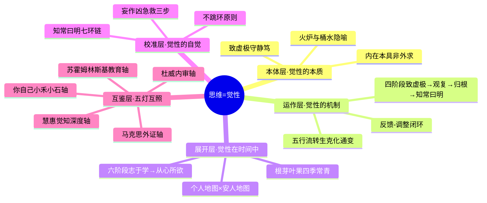

# 思维 知识萃取报告（V2.0·炼化版）

## 一、知识体系全景



> **全景说明**：审计报告揭示，思维不是孤立概念——它是"觉性"在运作层面的显化。思维（运作）·成长（展开）·修行（校准）是同一觉性绕不同轴转动的三个切面。新增"本体层"直接从《道德经》第十六章出发，"校准层"来自知常曰明七环链，"互鉴层"来自与杜威/马克思/苏霍姆林斯基的跨时空对话。

---

## 二、方法论体系重塑

### 第一性原理：思维是内在本具觉性的动态澄清——不是"获取"什么，而是"减少"遮蔽

原报告将思维第一性原理表述为"从无到有再从有归无的频率调校"，审计报告提供了一个更锋利的版本：**思维的本质不是知识积累，而是内在本具觉性的自我澄清**——遇缘生起，反馈调整，虚极静笃中照见本空，回归自在妙用【出处：《思维成长修行自洽性审计报告_V2.2》】。

这个定义根植于《道德经》第十六章："致虚极，守静笃。万物并作，吾以观复。夫物芸芸，各复归其根。归根曰静，是谓复命。复命曰常，知常曰明"【出处：同上】。四句话四层深度，不是四个独立步骤，而是同一觉性从遮蔽到澄明的渐次剥落。

**火炉与桶水的核心隐喻**：教育是点燃一把火，不是灌满一桶水【出处：《思维成长修行自洽性审计报告_V2.2》】。火是整全的、自己烧的；水是散的、灌进去的。添柴（知识输入）有益，但当人把水（负面标签、焦虑比较、"为你好"的补课）当柴泼进去时，火就被浇灭了。小石就是被三重"妄作凶"叠加差点浇灭的那把火——学校标签"差生"→ 妈妈焦虑比较 → 小石内化"我什么都不好"【出处：同上】。

### 核心支柱（V2.0重构）

#### 支柱一：四阶段澄清 —— 觉性从遮蔽到澄明

原报告的三支柱（认知建构力→批判超越力→空性回归力）虽有"回归"一环，但缺少对"觉性本体"的正面阐述。审计报告提供的四阶段模型补上了这个根【出处：《思维成长修行自洽性审计报告_V2.2》】：

| 阶段 | 关键词 | 内涵 | 检验标准 |
|------|--------|------|----------|
| **致虚极，守静笃** | 本体虚静 | 未被内容填充的清醒觉知，放下预设，不粘着 | 能否在3秒内放下"我必须想出来"的执念？ |
| **万物并作，吾以观复** | 观复觉察 | 如实观察念头生灭而不干预，建立反馈-调整闭环 | 能否看见"我在焦虑"而不被焦虑吃掉？ |
| **归根曰静** | 能所双亡 | "我"和"我的想法"之间的对立消融 | 能否不追内容，安住本体？ |
| **知常曰明** | 自在妙用 | 任运思维，不执不拒，用完即放 | 能否在需要时全力以赴，不需要时一片澄明？ |

> 核心定义：**思维，是内在本具的觉性，遇内外诸缘而自然生起认知活动；经由反馈-调整的动态闭环，不断自我澄清、自我优化；最终在虚极静笃中，照见一切认知活动的根源本空，从而回归无为而不废妙用的自在状态。**【出处：《什么是"思维".md》/《思维成长修行自洽性审计报告_V2.2》】

**本支柱的现代困境对译**：当你在做PPT发现思路枯竭却死盯着屏幕时，这是"气机失衡状态"——对应《道德经》第十六章的"不知常，妄作凶"。你不是需要更多想法，而是需要先"致虚极"——**三呼吸归位法**：双手平放桌面，三次深呼吸，掌心由紧握翻为向上摊开。这个动作的信号是："我先不抓了。"【出处：《思维成长修行自洽性审计报告_V2.2》·妄作凶急救三步】

#### 支柱二：五行流转 —— 觉性在时间中的展开

原报告提到"生克化通变"但未展开。审计报告从《个人成长与价值实现的新范式》中提取了完整的五行成长引擎【出处：《个人成长与价值实现的新范式》】：

```
种子（木·生）→ 繁茂（火·化）→ 修剪（金·克）→ 更新（水·变）→ 迁移（土·通）
    ↑                                                                      │
    └──────────────────────────────────────────────────────────────────────┘
```

这与西方的"构建→批判"线性思维根本不同。五行是环形的：**克不是否定，而是修剪——不修剪的繁茂是徒长**。小禾观星三个月后突然"看到星座连线"，那不是知识的量变到质变，而是木（播种观星习惯）→火（三个月累积的感知化开）→金（某个夜里自然"修剪"掉多余干扰，连线浮现）——一次完整的五行流转【出处：《思维成长修行自洽性审计报告_V2.2》·小禾篇】。

**六阶段素养演化**为五行提供了时间轴：志于学（寻找方向）→而立（站稳脚跟）→不惑（坚定内心）→知天命（理解规律）→耳顺（接纳一切）→从心所欲（自然合道）【出处：同上】。注意：到"知天命"才开始真正理解规律，之前都在建构中。这意味着四大阶段中，前三个阶段（致虚极→观复→归根）可能贯穿从"志于学"到"知天命"的漫长过程。

#### 支柱三：知常曰明七环链 —— 从内明到外行的完整落地

原报告最薄弱的地方是"空性回归力"——讲得玄而不落地。审计报告用七环链把这个环节彻底打通了【出处：《思维成长修行自洽性审计报告_V2.2》】：

| 环序 | 名称 | 内涵 | 对应能力 | 翻车模式 |
|------|------|------|----------|----------|
| 一 | **知常曰明** | 认识并接纳规律 | 根（自爱）— 看见真实 | 不知常——以妄为常 |
| 二 | **知常容** | 因知常而变得包容 | 芽（自制）— 不强行改变 | 不容——想改变一切 |
| 三 | **容乃公** | 包容之后才能公平 | 叶（共情）— 看见完整 | 不公——从不容直接跳公 |
| 四 | **公乃全** | 公平之后才能完整 | 果（贡献）— 不偏私 | 不全——偏私成就 |
| 五 | **全乃天** | 完整即合乎天道 | — | — |
| 六 | **天乃道** | 合天道即合于道 | — | — |
| 七 | **道乃久，没身不殆** | 合道才能长久 | — | — |

**最关键的规则——不跳环**：不知常的人直接跳到"公"（讲公平），就是妄作。七环是"从内到外再回归内"的螺旋，不是线性清单。小禾从"知常"到"容"到"公"走了四年（12岁→16岁），中间每一步都是她自己在走，不是被推着跳【出处：同上·小禾篇】。

#### 三大支柱的动态关系（V2.0修正）

原报告的"建构→超越→回归"线性循环，在审计报告视角下应修正为：

```
                  四阶段澄清（纵向深潜）
                        │
         ┌──────────────┼──────────────┐
         ↓              ↓              ↓
   第一阶段·致虚极   第二阶段·观复   第三阶段·归根
   （放下预设）    （如实观察）    （能所双亡）
         │              │              │
         └──────────────┼──────────────┘
                        ↓
              第四阶段·知常曰明
              （自在妙用 = 五行流转×七环链展开）
                        │
               ┌────────┼────────┐
               ↓        ↓        ↓
           个人实践   社会验证   教育传承
          （杜威轴） （马克思轴）（苏霍姆林斯基轴）
```

原报告只走到了"自在妙用"，审计报告追问了：然后呢？自在之后有没有"妙用"？杜威问"你信的根据是什么"，马克思问"你验证过了吗"，苏霍姆林斯基问"你给孩子观察和自由的时间了吗"——这三问把"自在妙用"从内心状态拉回了行动现场【出处：同上·五灯互照】。

### 与西方思维观的互鉴：三支箭补三个盲区

审计报告通过马克思主义、杜威、苏霍姆林斯基三重视角，照出了原体系的三个盲区【出处：《思维成长修行自洽性审计报告_V2.2》】：

**盲区一：社会性与语言**（马克思主义照出）——四阶段模型几乎全是个体内在过程，未讨论思维如何在与他人的对话中被塑造。思维从来不只是"我"的事——小禾帮同桌编程、小石画恐龙漫画分给全班，思维在"分享"中被验证和深化。

**盲区二：实践检验机制**（马克思主义 + 杜威照出）——"知常曰明"的内在照见如何防止自欺？一个人可以自认为"知常"了，但实际上在"妄作"。杜威说：审视你信念的根据是否成立。马克思说：实践是真理的唯一标准。小石的课堂发言就是一次双重验证——杜威的"审视根据"（我不够好→谁说的→可靠吗）+ 马克思的"外证"（全班安静听→"我可以"）。

**盲区三：教育实践维度**（苏霍姆林斯基照出）——"两套教学大纲"精准解释了为什么小禾小石的觉醒发生在"第二套大纲"（天文馆照片、恐龙画册），而非"第一套大纲"（考试内容）。"让知识活起来"——苏霍姆林斯基1930年代就已论证的东西，与"道冲而用之或不盈"跨时空共鸣【出处：同上】。

---

## 三、核心观点溯源（V2.0新增项）

### 思维本体定义层

| 提炼观点 | 原文溯源 | 出处 |
|----------|----------|------|
| 思维是内在本具觉性的澄清 | "思维，是内在本具的觉性，遇内外诸缘而自然生起认知活动；经由反馈—调整的动态闭环，不断自我澄清……最终在虚极静笃中，照见一切认知活动的根源本空" | 《思维成长修行自洽性审计报告_V2.2》 |
| 火炉与桶水 | "教育是点燃一把火，不是灌满一桶水……添柴人最大的妄作是把水当柴泼进去" | 同上·七环链篇 |
| 不跳环 | "七环关键不在'环环都做到'，而在'不跳环'——不知常的人直接跳到'公'，就是妄作" | 同上·七环链总览 |

### 四阶段模型层

| 提炼观点 | 原文溯源 | 出处 |
|----------|----------|------|
| 致虚极守静笃 | "致虚极，守静笃。万物并作，吾以观复" | 《道德经》第十六章 |
| 观复 | "如实观察念头生灭而不干预，建立'外部信息与内在反应'的反馈" | 《思维成长修行自洽性审计报告_V2.2》·四阶段思维模型 |
| 归根曰静 | "'我'和'我的想法'之间的对立消融，从追内容转向安住本体" | 同上 |
| 知常曰明 | "任运思维，不执不拒，反馈-调整自动化，用完即放" | 同上 |

### 五行与成长层

| 提炼观点 | 原文溯源 | 出处 |
|----------|----------|------|
| 五行流转 | "种子（木·生）→繁荣（火·化）→修剪（金·克）→更新（水·变）→迁移（土·通）" | 《个人成长与价值实现的新范式》 |
| 克不是否定是修剪 | "不修剪的繁茂是徒长" | 《思维成长修行自洽性审计报告_V2.2》·五行解读 |
| 六阶段素养演化 | "志于学→而立→不惑→知天命→耳顺→从心所欲" | 《个人成长与价值实现的新范式》 |

### 互鉴与盲区层

| 提炼观点 | 原文溯源 | 出处 |
|----------|----------|------|
| 杜威四层含义 | "对任何一个信念……以积极的、执著的和用心的态度考虑它所依据的根据是否成立……这就构成思考" | 杜威《我们如何思维》第一章 |
| 三支箭 | "杜威：你信的根据是什么？马克思：你验证过了吗？慧惠：你现在静得下来吗？" | 《思维成长修行自洽性审计报告_V2.2》·三支箭 |
| 两种思维类型 | "形象思维（艺术型）与逻辑分析思维（数学型）——因材施教，不可用抽象训练压制形象思维" | 苏霍姆林斯基《给教师的建议》 |
| 两套教学大纲 | "第一套：必记知识；第二套：智力背景——课外阅读、观察材料——'智力背景越广阔，理解就越深刻'" | 同上 |

---

## 四、实战行动指南（V2.0炼化版）

### 场景1：思路枯竭时（PPT做不完 / 写不出方案）

**最小可行性动作**：不思考。双手平放桌面，掌心向上翻开，三次深呼吸。不说"我要想出办法"，只感受手心的温度。然后问一句："我现在最需要看见的是什么？"

**应用要点**：
1. 这是四阶段模型中"致虚极"的落地——枯竭不是缺东西，是装太满了
2. 掌心翻上 = 从"抓取"模式切到"接收"模式，这是身体辅助思维切换
3. 问"最需要看见什么"而非"最需要想出什么"——观复而非造作

**潜在翻车点**：
- ⚠️ "放松=偷懒"的自责 → 应对：承认"妄作凶"，以"损"代"益"。对应《道德经》第四十八章："为道日损。"
- ⚠️ 放松后依然空白 → 应对：进入五行流转——不再对着空白屏幕硬想（那是"火"烧过头了），去做一件完全不相关的事（"水"变），让答案自己浮出来

### 场景2：被负面想法困住（"我不够好"循环）

**最小可行性动作**：拿出一张纸，左边写"我的判断"，右边写"这个判断的根据"。写完后对右边每一行追问"这个根据可靠吗？谁说的？有反例吗？"

**应用要点**：
1. 这是杜威"审视信念根据"的落地【出处：《思维成长修行自洽性审计报告_V2.2》·杜威互鉴】
2. 小石的"我不够好"背后站着三个根据——审视它们，就是推翻妄念的第一步
3. 配合"七环链日常自问"：我在哪一环出了问题？焦虑→不知常 / 自我否定→不容自己

**潜在翻车点**：
- ⚠️ 审视变成自我批判 → 应对：审视信念≠批判自己。格式是"这个判断的根据可靠吗？"不是"我怎么这么蠢？"
- ⚠️ 发现根据不可靠后反而更慌 → 应对：进"妄作凶急救三步"——停（双手平放，三次深呼吸）→ 问（食指轻点眉心："我在逆什么常道？"）→ 归（掌心向上翻："回到我自己的常道"）

### 场景3：学了太多思维模型，反而不会思考了

**最小可行性动作**：停止收集。今天只做一件事——找一个你最有把握的判断，动手验证它。不是再用脑子想，是去现实中试。

**应用要点**：
1. 这是马克思"实践检验"的落地——不验证的知可能是自欺【出处：同上·马克思互鉴】
2. 审计报告自审：三个概念（思维·成长·修行）看起来完美自洽，但"潜在不自洽不在概念之间，而在概念与使用者之间"——一个人明明可以"自在妙用"（第四阶段），却仍在反复审计概念是否完美（第一阶段行为），这就是"用概念杀死概念"
3. 口诀：**为学日益，为道日损。损之又损，以至于无为。** 损掉的是对"更多模型"的贪求

**潜在翻车点**：
- ⚠️ "再学一个就开始做" → 应对：回到五行——"火"化太久没"金"克，修剪！删掉三个待读清单里的书
- ⚠️ 一做就失败 → 应对：失败不是你的问题，是火遇到了风。小禾观星三个月才看到连线——重要的事"烧得慢"【出处：同上·小禾篇】

### 场景4：想帮别人但对方不领情

**最小可行性动作**：先问自己——我在添柴还是泼水？如果答案是"添柴"，再问：他现在炉膛（环境与节律）还在吗？如果炉膛都没搭好，柴添不进去。

**应用要点**：
1. 这是火炉隐喻的应用——小石妈妈"为你好"的补课是泼水，只放一本恐龙画册（减法）才是添柴【出处：同上·小石篇】
2. 七环链的不跳环原则——先确保自己"知常"（认识并接纳规律），才有资格"容"（不强行改变别人）
3. 苏霍姆林斯基的补充——不是直接把结论告诉对方，让对方自己去观察、发现

**潜在翻车点**：
- ⚠️ "我是为你好啊" → 应对：小禾同桌的例子——你以为是添柴，对方感受到的是泼水。停下来，问对方："你现在最需要我帮你做什么？" 不管他怎么回答，都先三次深呼吸再回应
- ⚠️ 对方确实需要帮助但方法不对 → 应对：不要给结论（那是灌水），给他"第二套大纲"（智力背景材料）

### 场景5：教育孩子时觉得他"不如别人"

**最小可行性动作**：在评价孩子之前，先写下一行字："他不擅长______，但他最自然的______是什么？" 然后只盯着后半行看。

**应用要点**：
1. 苏霍姆林斯基警告：小石的主导思维是形象思维型（沉浸在恐龙世界），学校只用抽象训练来衡量他——教育系统本身就在制造"差生"【出处：同上·苏霍姆林斯基互鉴】
2. "两种思维类型"——艺术型和逻辑型，不是高低之分
3. 小禾12岁的发现："我的火不需要每天都很旺。只要每天添一小把柴，三个月后，它会在某个夜里突然照亮整片天空"——伤人的不是火烧得慢，而是人嫌火慢，拿棍子去搅，搅灭了【出处：同上·小禾篇】

**潜在翻车点**：
- ⚠️ "社会竞争激烈，不能等" → 应对：社会竞争激烈是事实，但"妄作凶"只会让火灭得更快。给"第二套大纲"——不是不学，是给智力背景
- ⚠️ 不知道他擅长什么 → 应对：再问一遍自己真正看到了什么。小石的恐龙之火从来没有熄灭过，只是暗了。"道冲而用之或不盈"——不是灌满，而是掏空。减法才能看见
