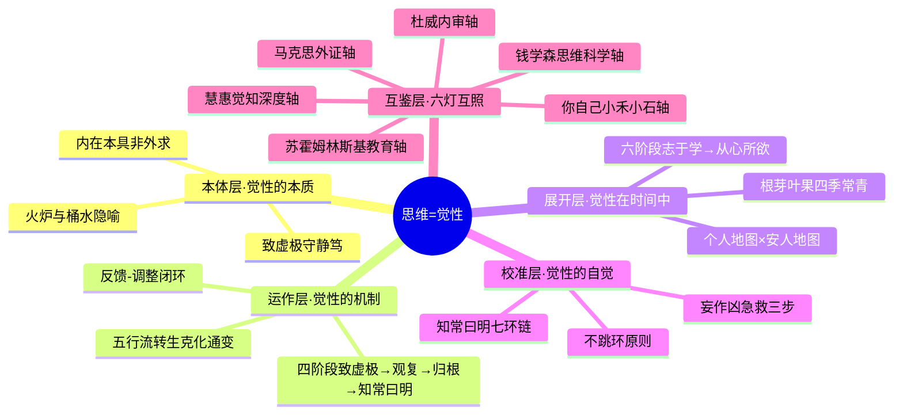

# 思维 知识萃取报告（V3.0·钱学森互鉴版）

> 基于 V2.0 炼化版，新增钱学森思维科学体系互鉴。

---

## 一、知识体系全景（V3.0更新）

## 二、方法论体系重塑（V3.0新增：钱学森互鉴）

### 前言：六灯汇聚

V2.0 以杜威、马克思、苏霍姆林斯基三支箭补了三个盲区。但知识库里还有一盏更亮的灯——**钱学森的思维科学体系**——一个从1980年代起就系统构建、横跨哲学到工程技术的完整大厦。

钱学森对思维的研究不是一篇文章，而是毕生建构的体系：1983年《关于思维科学》发端，1984年全国思维科学研讨会成型，1993年致戴汝为的最后一封信仍在迭代思维分类。从三大思维到四大思维到象智/性智/量智，钱学森在思维科学上走了整整十年。

### 钱学森思维科学核心框架

#### 一、思维科学的定位——"第四大部类"

"思维科学是区别于自然科学、数学科学和社会科学的新的科学技术大部类，研究范围限定为人的有意识思维，下意识相关内容归入人体科学研究范畴，其与马克思主义哲学的桥梁为认识论。"【出处：《思维科学-钱学森《必读》》】

这个定位极其重要。通常我们以为"思维"是哲学或心理学的事，钱学森直接把它提格到与自然科学并列的独立大部类——思维有自己的基础科学、技术科学、工程技术三层结构，是一个完整学科体系。

#### 二、三种思维（1983-1984）

"一般好像认为思维有两大类，一类叫逻辑思维或抽象思维，一类叫形象思维。……但我认为就是现在也不能以为思维就只有这两类。还有一类可称为灵感，也就是人在科学或文艺创作中的高潮，突然出现的、瞬息即逝的短暂思维过程。"【出处：同上】

| 类型 | 特征 | 基础科学 | 研究状态 |
|------|------|----------|----------|
| **抽象（逻辑）思维** | 线型或分核型，一步步推下去 | 逻辑学 | 较成熟，电子计算机的理论基础 |
| **形象（直感）思维** | 面形、二维，连来龙去脉都搞不清楚 | 形象思维学 | **未创立**，被钱学森定为突破口 |
| **灵感（顿悟）思维** | 极短，几秒甚至一秒 | 灵感学 | **未创立**，"一旦掌握，人人可成天才" |

1984年全国思维科学研讨会上，钱学森又加入了第四类——**社会思维学**：研究人的思维在集体中如何被塑造和激发。这与马克思主义照出的"社会性与语言"盲区直接呼应。

#### 三、形象思维——钱学森选定的突破口

为什么选形象思维而不是逻辑思维？逻辑思维已经有逻辑学、有电子计算机了。形象思维则是人类大量知识财富的藏身之所，但我们对其规律几乎一无所知。

"人认识客观世界首先是用形象思维，而不是用抽象思维。……小孩子也是从形象思维开始。语言先于思维，是指抽象思维而言的，形象思维是在语言以前就有的。"【出处：《钱学森论思维科学与"何新树"》】

这段话极为关键——**形象思维在语言之前**。这与我们四阶段模型中"致虚极"的内涵高度吻合：第一阶段正是放下语言和预设，回到未命名的纯粹觉知。觉性不是"想出来的"，它是形象思维和抽象思维的共同本源。

钱学森还指出："一旦掌握了形象思维学，会不会用它来掀起又一项新的技术革命呢？"他拿逻辑学→电子计算机的革命做类比：逻辑学产生了计算机，形象思维学如果创立了，会产生什么？从今天的AI发展看——大语言模型已经掌握了逻辑思维（文本推理），但**图像识别、直觉判断、创造性联想**仍然是瓶颈。钱学森1983年的预言，在2026年仍然精准。

#### 四、"何新树"——数理辩证逻辑的雏形

"如果把集合论的二维平面Venn图加以发展，引入时间，形成三维的结构，成为枝干有粗细的'树林'，也许有可能引出'数理辩证逻辑'，把辩证思维严格地规律化。到那时才能真正进入抽象思维学。"【出处：《钱学森论思维科学与"何新树"》】

这个设想是"何新树"的由来——在静态的逻辑关系图上加入时间维度，让概念之间的演化关系可视化。它不只是一个技术点子，而是一种**动态辩证逻辑**的尝试。

#### 五、1993年的新分类：象智·性智·量智

十年后，钱学森在致戴汝为的信中提出了升级版分类【出处：《钱学森 | 1993年1月25日 致戴汝为（思维科学）》】：

| 智的类别 | 层级 | 内涵 |
|----------|------|------|
| **象智** | 低层次 | 形象直觉层面的智能——看到即知，不经过概念 |
| **性智** | 高层次 | 对事物本质的整体把握——超越象智的深层直觉 |
| **量智** | 并行的另一维度 | 逻辑分析、数学量化的智能——精确但有限 |

这个分类把1983年的"形象/逻辑/灵感"三维升级为一个**两层+一维**的架构：象智→性智是纵向深度（从直观到本质），量智是横向精度（从模糊到精确）。一个人的大成智慧需要**升降自如**——能从精确分析（量智）降到直觉感知（象智），再从直觉升到本质把握（性智）。

**与我们四阶段模型的对应**：

| 钱学森分类 | 四阶段对应 | 说明 |
|-----------|-----------|------|
| 象智 | 观复（第二阶段） | 不经过概念的直接觉察——看到图形就知道是什么 |
| 量智 | 第一阶段~第三阶段的辅助 | 逻辑推理用于验证，但不是思维的根 |
| 性智 | 归根→知常曰明（第三→第四阶段） | 对本质的整体把握，"能所双亡"后的自然妙用 |

#### 六、大成智慧与人机结合

钱学森人工智能思想的终极目标是**大成智慧**："打破学科壁垒，整合古今各类知识与群体智慧，打造兼具理解、创造与价值判断能力的高阶智慧体系。"【出处：《钱学森人工智能思想的变革与现实启示》】

核心方法论：
- **人机结合、以人为主**：人是智能活动的主体，AI是辅助工具
- **定性定量综合集成研讨厅**：将人的定性经验与机器的定量计算结合，整合多领域专家群体智慧
- **灵境技术**：钱学森1990年代提出的概念，即今天的VR/AR——"通过多媒体技术、灵境技术提升人的感知能力"【出处：《钱学森 | 1993年致戴汝为》】

这个方法论与我们七环链的"不跳环"原则形成有趣的对照：钱学森的**"以人为主"不是一句口号，而是一个架构原则**——不管你用多少AI辅助思考，最后的"知常曰明"必须是人自己走到。

---

### 钱学森照出的盲区与补充

#### 盲区一：思维科学作为独立学科的系统构建

我们原有的四阶段模型和觉性框架侧重于"个体如何澄清思维"，钱学森则追问了"思维研究本身如何成为科学"。这补上了我们体系中最缺失的**科学化维度**——思维不只是修行的对象，也是可以用宏观（心理内省+精密仪器）和微观（脑神经结构）双路径研究的对象。

#### 盲区二：形象思维的独立价值

我们四阶段模型中"观复"强调如实观察而不干预，但没有区分"观察形象"和"观察文字概念"。钱学森明确指出**形象思维在抽象思维之先，在语言之先**——这不只是先后顺序，而是一个根本洞见：**并不是所有有价值的思维都能被语言捕获**。苏霍姆林斯基说的"表象越丰富，思维就越活跃"，小禾看到星座连线的直觉，小石沉浸在恐龙世界的形象感——这些都是形象思维在运作，但我们在理论框架中没有给它独立的位置。

#### 盲区三：社会思维学的缺失

V2.0中马克思主义照出了"社会性与语言"的盲区，钱学森的社会思维学给出了更系统的回答：人的思维质量"一是靠社会实践，二是靠知识。知识是人类社会实践的一个非常重要的补充。所以人的思维是集体的。"他引用鹅湖之会、哥白尼的学术互助组织来论证"集体讨论对思维跃迁的催生作用"——这与"公乃全"（包容之后才能完整）在七环链中的位置形成互证：七环链的"公"不只是道德要求，更是**认知需要**。

---

### 六灯互照：完整的思维地图（V3.0）

| 思想源 | 核心追问 | 对应维度 |
|--------|----------|----------|
| **钱学森** | "形象思维的规律是什么？灵境技术如何拓展人的感知？" | 科学建构轴 |
| **杜威** | "你审视过这个信念的根据吗？" | 认知品质轴 |
| **马克思** | "你验证过了吗？" | 实践验证轴 |
| **苏霍姆林斯基** | "你给了孩子观察和自由的时间吗？" | 教育实践轴 |
| **慧惠（自体系）** | "你现在静得下来吗？觉性在哪里？" | 觉知深度轴 |
| **你自己** | "小禾和小石——他们七岁就做得到。我们呢？" | 生命实证轴 |

---

## 三、核心观点溯源（V3.0新增）

### 钱学森思维科学层

| 提炼观点 | 原文溯源 | 出处 |
|----------|----------|------|
| 思维科学是第四大部类 | "思维科学是区别于自然科学、数学科学和社会科学的新的科学技术大部类" | 《思维科学-钱学森《必读》》 |
| 三大思维分类 | "一类叫逻辑思维或抽象思维，一类叫形象思维……还有一类可称为灵感" | 同上 |
| 形象思维为突破口 | "人认识客观世界首先是用形象思维……形象思维在语言以前就有的……我建议把形象（直感）思维作为思维科学的突破口" | 《钱学森论思维科学与"何新树"》 |
| 何新树 | "把集合论的二维平面Venn图加以发展，引入时间，形成三维的结构，成为枝干有粗细的'树林'" | 同上 |
| 象智·性智·量智 | "性智划分为低层次的象智和高层次的性智，与量智共同构建新的思维分类框架" | 《钱学森 | 1993年致戴汝为》 |
| 大成智慧 | "打破学科壁垒，整合古今各类知识与群体智慧，打造兼具理解、创造与价值判断能力的高阶智慧体系" | 《钱学森人工智能思想的变革与现实启示》 |
| 人机结合以人为主 | "人机结合过程中人始终处于核心地位" | 《钱学森 | 1993年致戴汝为》 |
| 灵境技术 | "可通过多媒体技术、灵境技术以及国外相关研究成果提升人的感知能力" | 同上 |
| 社会思维学 | "人的思维是集体的……思维质量一是靠社会实践，二是靠知识" | 《钱学森论思维科学与"何新树"》 |
| 灵感可研究 | "灵感是人社会实践的结果，不是神授……是有规律的，我们要研究它，要创立一门'灵感学'" | 《思维科学-钱学森《必读》》 |

### 与自体系对照层

| 对照点 | 钱学森 | 自体系（四阶段/七环链） |
|--------|--------|------------------------|
| 形象思维的定位 | 突破口，在语言之先 | 对应"观复"中不经过概念的直接觉察 |
| 逻辑思维的局限 | 图灵机只能做逻辑思维，不能创新 | 对应"知常曰明"——不执不拒的超逻辑妙用 |
| 社会性 | 人的思维是集体的 | 对应七环链"容乃公→公乃全" |
| 研究路径 | 宏观（内省+仪器）+微观（脑神经） | 宏观=致虚极+观复；微观=五行流转机制 |
| 终极指向 | 大成智慧（人机结合） | 知常曰明（觉性圆满） |
